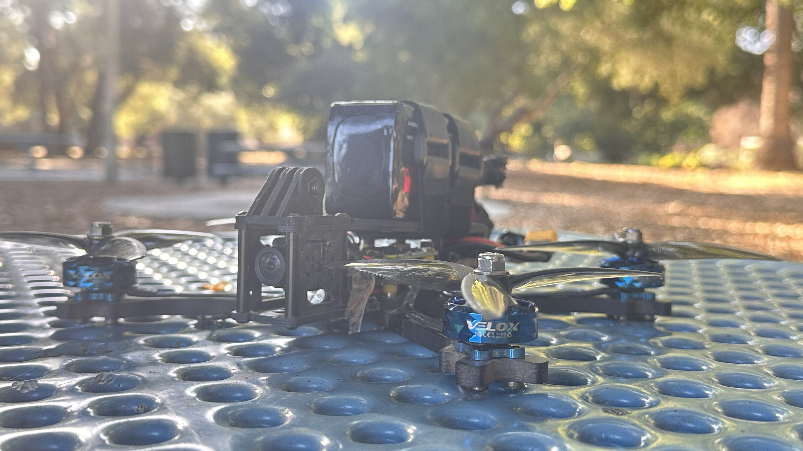

   
  <em>My First 5" Racing Quad</em>

## Parts List for This Build

| Part | Name | Price | Site |
|------|------|-------|------|
| **Frame** | TBS SOURCE ONE V5.1 5-inch Frame | $30 | Pyrodrone |
| **Props** | (2x) Gemfan Fury 5128 3 (5.1x2.8x3) PC | $6 | Pyrodrone |
|          | (2x) HQ Prop FlowerPig 5129 5.1" | $6 | Pyrodrone |
| **Motor** | (4x) T-Motor Velox Veloce V2306.5 V2 – 1950KV | $70 | Pyrodrone |
| **Camera** | RunCam Phoenix 2 SE Micro Analog FPV Camera | $24 | Pyrodrone |
| **Receiver** | RP1 V2 ExpressLRS 2.4GHz Nano Receiver | $12 | Pyrodrone |
| **FC + ESC** | SpeedyBee F405 V4 BLS 55A 30x30 FC & ESC Stack | $66 | Speedy Bee |
| **VTX (camera)** | SpeedyBee TX800 | $34 | Speedy Bee |
| **Antenna** | SpeedyBee 5.8GHz Antenna V2 (MMC-Straight) | $6 | Speedy Bee |
| **Battery** | (2x) CNHL 1300mAh 6S LiPo Battery 22.2V 100C | $60 | Amazon |
| **Smoke Stopper** | VIFLY ShortSaver | $13 | Amazon |
| **Radio** | RadioMaster Pocket M2 RC Transmitter (FCC) | $85 | Pyrodrone |
| **LED Strip** | MATEKSYS 2812 6LED Arm (4pcs) | $5 | Pyrodrone |
| **Goggles** | Skyzone Cobra X V4 5.8GHz FPV Goggles | $270 | — |

**Battery Weight:** 223g

## Motor Selection Guide

### Brushless Motor Basics
- Brushless DC motors have 3 leads. Any connection order will work with the ESC.
- To reverse rotation, swap any two leads.
- **Ideal KV Example:** 1900KV is a good all-around size for 5" builds.

**Ideal Thrust-to-Weight Ratio**
- Minimum: **2:1** (stable flight)
- Optimal: **4:1** (high performance / FPV freestyle)

---

### Motor Size Preferences

| Motor Size | Common Use |
|------------|------------|
| **0803** | Tiny whoops with 40mm props |
| **1105, 1204, 1303** | Lightweight 3" with shallow pitch props |
| **1506** | Heavy 3" with aggressive pitch |
| **2207** | Standard for 5" racing |
| **2306** | Common for 5" freestyle |
| **2806.5** | For 7" long-range builds |

---

### Motor KV and Battery Recommendations

| Battery | Typical KV & Motor Size |
|---------|------------------------|
| **1S whoop** | ~16000KV 0803 |
| **2S whoop** | ~12000KV 0803 |
| **2S 3"** | ~8000KV 11xx |
| **3S 3"** | ~5000KV 12xx |
| **4S 3"** | ~3600KV 14xx–15xx |
| **4S 5"** | ~2400KV 22xx or 23xx |
| **5S 5"** | ~1800KV 22xx or 23xx |
| **6S 7"** | ~1800KV 28xx |
| **6S 7" (efficiency)** | ~1300KV 28xx |

---

### Quick Reference for Frame Size to Motor Range

| Frame Size | Motor Size Range |
|------------|------------------|
| 2"–3" | 08xx–11xx |
| 3" lightweight | 12xx–13xx |
| 3" heavy / toothpick | 14xx–16xx |
| 4" | 16xx–18xx |
| 5" | 22xx–24xx |
| 7" | 25xx–28xx |

   

   

   

## Build Procedure

### 1. Frame and Motor Assembly
1. Assemble frame plates and arms according to the frame layout.
2. Mount motors to arms using screws of proper length to avoid contacting windings.
3. Route motor wires toward the center for ESC connection.

---

### 2. FC and ESC Stack
1. Mount the 4-in-1 ESC to the frame with soft mounting grommets.
2. Stack the flight controller above the ESC using spacers.
3. Ensure the FC arrow faces the front of the aircraft.

---

### 3. Wiring and Soldering
1. Solder motor wires to ESC pads (swap any two wires to reverse rotation).
2. Solder ESC power leads to main battery pads.
3. Solder camera, VTX, and receiver wires to FC following the wiring diagram.
4. Install and secure antennas for both VTX and receiver.
5. Verify polarity on all power connections before applying power.

> **Wiring Diagrams:**  
>   
> 

---

### 4. Receiver Binding
1. Connect the receiver to a free UART on the FC.
2. Power the system and put the receiver in bind mode.
3. Bind to the transmitter and confirm link via LED indicators.

---

### 5. Firmware Flashing and Configuration
1. Install [Betaflight Configurator](https://betaflight.com/) and connect the FC via USB.
2. Flash the latest stable firmware for your FC model.
3. Configure receiver protocol, modes, and motor direction.
4. Calibrate accelerometer and verify stick inputs.
5. Set failsafe behavior and arming conditions.

---

### 6. Final Assembly and Testing
1. Secure all wiring with zip ties or tape.
2. Install props in correct orientation.
3. Perform motor direction test in Betaflight with props **off**.
4. Conduct a short hover test, then tune PID and rates if needed.

# Drone FPV Systems: Analog vs Digital

## Cost Comparison
| Component | Analog | Digital (DJI) |
|-----------|--------|---------------|
| **Camera** | $15 – $40 | Included in Camera/VTX bundle ($140 – $229) |
| **VTX (Video Transmitter)** | $15 – $40 | Included in Camera/VTX bundle |
| **Goggles** | $80 – $500 | $429 – $649 |

---

## Analog FPV Systems

**Pros**
- Lower entry cost compared to digital systems  
- Widely available with extensive compatibility across manufacturers  
- Consistently low latency suitable for racing  
- Large variety of hardware options and features at different price points  

**Cons**
- Low image quality (similar to older TV with poor reception)  
- More susceptible to interference and electrical noise  
- Hardware quality varies significantly between manufacturers  

---

## Digital FPV Systems (DJI O3 and Similar)

**Pros**
- Industry-leading image quality, especially with the DJI O3 Air Unit  
- Strong resistance to interference  
- DJI V1 and V2 FPV goggles support analog video input (requires adapter and receiver)  

**Cons**
- Proprietary ecosystem — locked to DJI products  
- Variable latency, less ideal for competitive racing  
- No compact VTX option for micro drones  
- Must use DJI goggles (no third-party receiver module support)  
- No HDMI input or support for other digital FPV systems  

---

## System Selection Guidance

- **Highest Image Quality & Range**  
  Choose **DJI FPV system** for maximum visual fidelity and long-distance capability.  

- **Flexibility & Multiple Drone Sizes**  
  Choose **Walksnail** for strong image quality, freestyle, long-range cruising, and racing with 540p Race mode.  

- **Lowest Latency & Racing Focus**  
  Choose **HDZero** for competitive racing, micro drone compatibility, and long-range capability.  
